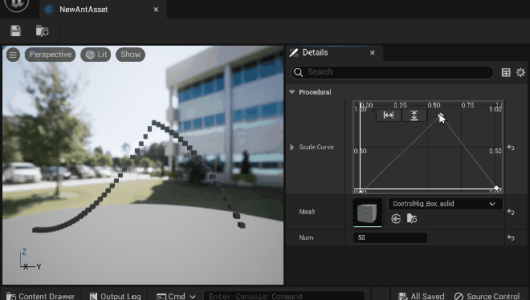

本插件基于UE5.1.1：[EpicGames/UnrealEngine at 5.1.1-release (github.com)](https://github.com/EpicGames/UnrealEngine/tree/5.1.1-release)

## 1 AntAsset

对应知乎文章：[UE5编辑器开发（一）：实现带Viewport和Thumbnail的自定义Asset - 知乎 (zhihu.com)](https://zhuanlan.zhihu.com/p/613083956)

效果：

## 2 AntEdMode

 对应知乎文章：[UE5编辑器开发（二）：实现自定义编辑模式(EdMode) - 知乎 (zhihu.com)](https://zhuanlan.zhihu.com/p/636308168)

